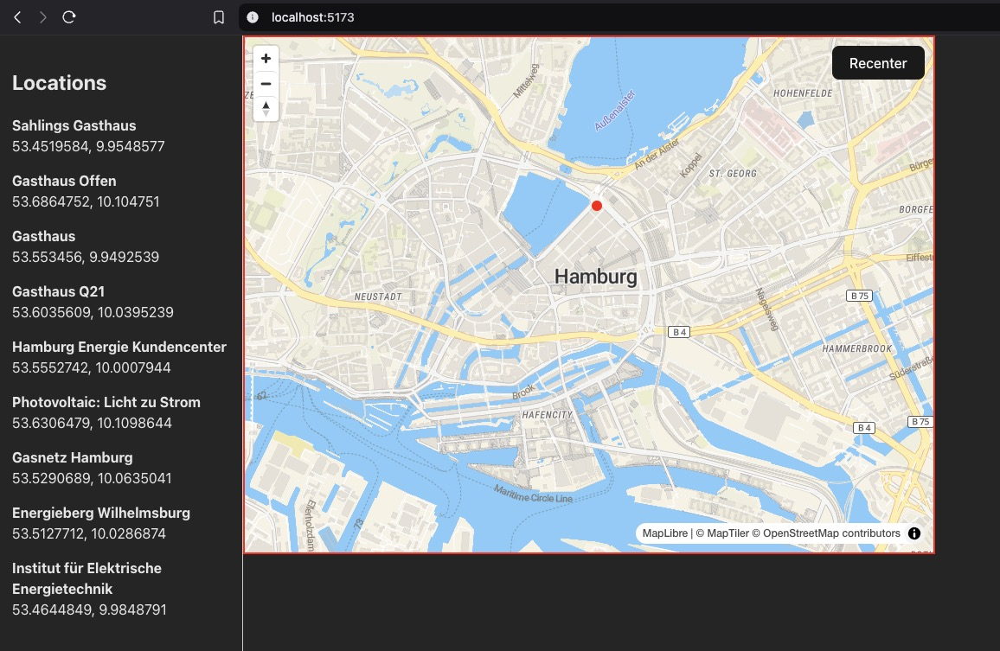
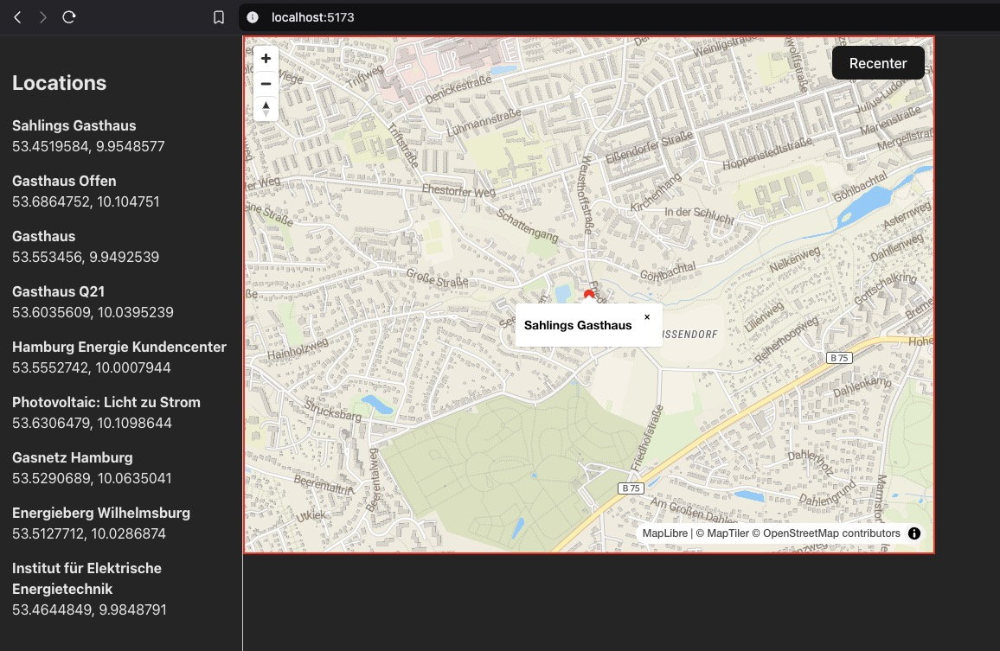
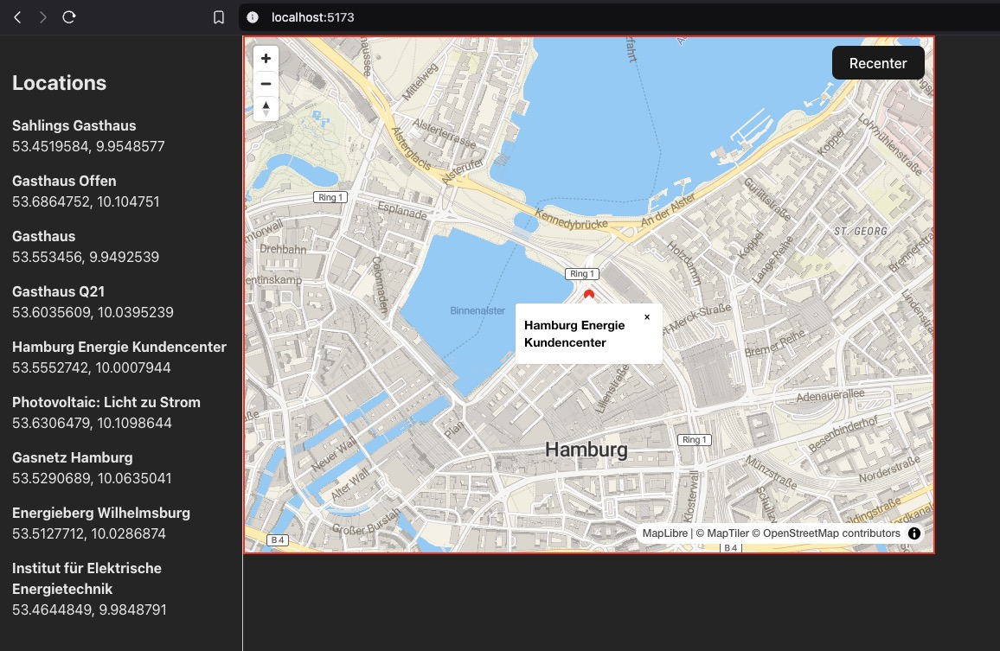

# FullStack-GIS-App
A full-stack web-based Geographic Information System (GIS) application built with React, FastAPI, and PostgreSQL/PostGIS. It allows users to view, search, and manage geographic locations on an interactive map.

## Tech Stack ## 
- Frontend: React, MapLibre GL, Vite
- Backend: FastAPI, PostgreSQL with PostGIS
- DevOps: Docker
- Languages: Python, JavaScript

## Screenshots ## 

